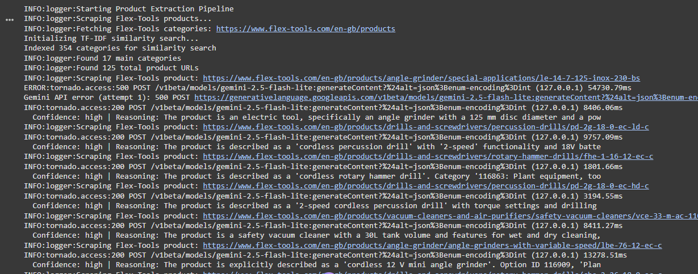
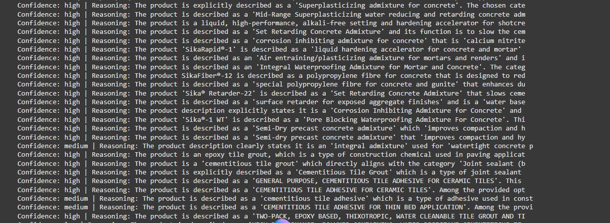

# eProcurement.ai - Technical Approach Document

## Overview
This document outlines the technical approach for extracting and classifying product data from Sika and Flex-Tools websites.

## Tools & Libraries Used

### Core Dependencies
- **Python 3.8+**: Primary programming language
- **requests**: HTTP library for web scraping
- **BeautifulSoup4**: HTML parsing and data extraction
- **pandas**: Data manipulation and CSV handling
- **xml.etree.ElementTree**: XML sitemap parsing
- **faiss-cpu**: CPU-based approximate nearest neighbor search for similarity matching
- **genai**: AI model for text classification
- **sklearn**: Machine learning for text classification


### Installation
```bash
pip install requests beautifulsoup4 pandas lxml faiss-cpu genai sklearn sentence-transformers
```

## Architecture

### 1. Data Collection Strategy

#### Sika Products (gcc.sika.com)
- **Method**: XML Sitemap parsing
- **Source**: `gcc.sika.com/en/products.sitemap.xml`
- **Approach**: 
  - Parse sitemap XML to extract all product URLs
  - Direct scraping of known product pages
  - Handles XML namespace properly
  
#### Flex-Tools Products (www.flex-tools.com)
- **Method**: Recursive crawling
- **Approach**:
  1. Start at `/en-gb/products`
  2. Extract category links using CSS selector `a.card-link`
  3. For each category, extract subcategories
  4. For each subcategory, extract product cards
  5. Follow product URLs to detail pages
- **Challenge**: No working sitemap, requires multi-level crawling

### 2. Data Extraction

#### Extraction Patterns

##### Sika Products
```python
# Product structure identified from sample HTML:
- Product Name: h1[itemprop="name"]
- Short Description: div.cmp-product__description--short
- Long Description: p[itemprop="description"]
- Datasheet: a[href$=".pdf"]
- Technical Specs: table rows in accordion sections
- Images: img[itemprop="image"]
```

##### Flex-Tools Products
```python
# Expected patterns (adaptable):
- Product Name: h1
- Model Number: span.model-number or URL slug
- Descriptions: .product-description, .short-description
- Specs: table.specs, .specifications table
- Datasheet: a[href$=".pdf"]
```
!! there was one challenging products that their pages differs from others because it have multible versions.

#### Technical Specifications Extraction
- Extracts key-value pairs from HTML tables
- Captures multiple table formats
- Stores as JSON for flexibility
- Includes: dimensions, power, weight, materials, standards

### 3. Classification Strategy

#### Gemini API
we used gemini api with TF-IDF for speed.

```python
# Find 20-30 MOST RELEVANT categories using similarity
similar_categories = find_similar_categories(product_text, top_k=30)

# Send only relevant ones to Gemini
category_context = "\n".join([
    f"ID: {row['id']} | Similarity: {score:.3f} | Path: {full_path}"
    for row in similar_categories
])
```

**Benefits:**
- Only sends relevant categories
- Reduces token usage
- Improves accuracy (fewer distractions)
- Faster Gemini responses
- Intelligent, adaptive category selection
- Provides similarity scores as hints

## How It Works

##### Two Approaches Supported
there is two approaches to provide category context to the model to choose from:

###### 1. TF-IDF
```python
classifier = GeminiClassifier(
    api_key, 
    tree_df,
    use_sentence_transformers=False  # Default
)
```

**Characteristics:**
- Fast initialization
- Minimal memory footprint
- Fast similarity search
- No extra dependencies (just scikit-learn)
- Good accuracy

**How it works:**
1. Converts category names to TF-IDF vectors
2. Converts product description to TF-IDF vector
3. Computes cosine similarity
4. Returns top-K most similar categories

###### 2. Sentence Transformers (semantic search) (Better Accuracy)
use ewe can also use embedding database like chromaDB/Faiss with embedding models as jinaai or any.
note: implemented but not tested yet.
```python
classifier = GeminiClassifier(
    api_key, 
    tree_df,
    use_sentence_transformers=True
)
```

**Characteristics:**
- Better semantic understanding
- Improved accuracy
- Slower if not via API
- Larger memory
- Requires: `pip install sentence-transformers` or `chromadb` which supports jinaai api

**How it works:**
1. Uses pre-trained transformer model (all-MiniLM-L6-v2/jinaai-embeddings-v3)
2. Encodes categories and product as dense embeddings
3. Computes cosine similarity in embedding space
4. Returns top-K most similar categories


### 4. Data Pipeline Flow

```
┌─────────────────┐
│  Start Pipeline │
└────────┬────────┘
         │
    ┌────▼────┐
    │  Load   │
    │ Class.  │
    │  Tree   │
    └────┬────┘
         │
    ┌────▼─────────────┐
    │  Fetch Product   │
    │      URLs        │
    │                  │
    │ • Sika: Sitemap  │
    │ • Flex: Crawl    │
    └────┬─────────────┘
         │
    ┌────▼────────┐
    │   For Each  │
    │   Product   │
    └────┬────────┘
         │
    ┌────▼────────┐
    │   Scrape    │
    │   Details   │
    └────┬────────┘
         │
    ┌────▼────────┐
    │   Extract   │
    │    Data     │
    └────┬────────┘
         │
    ┌────▼────────┐
    │    Get      │
    │    Context  │
    └────┬────────┘
         │
    ┌────▼────────┐
    │  Classify   │
    │   with Gemini│
    └────┬────────┘
         │
    ┌────▼────────┐
    │   Create    │
    │   Product   │
    │   Object    │
    └────┬────────┘
         │
    ┌────▼────────┐
    │   Export    │
    │   to CSV    │
    └─────────────┘
```

## Output Format

### CSV Structure
```csv
brand,product_name,model_article_number,category,subcategory,type_id,classification_path,technical_specs,short_description,long_description,product_image_url,datasheet_url,source_url
```

### Sample Output
```
Sika,SikaWrap®-600 C WV,600,Construction materials,Reinforcement,116XXX,115547.116XXX.116XXX.116XXX,"{""thickness"":""0.331mm"",""tensile_strength"":""4000 N/mm²""}",Woven unidirectional carbon fibre fabric...,SikaWrap®-600 C WV is a unidirectional...,https://gcc.sika.com/images/...,https://gcc.sika.com/dam/dms/gcc/2/sikawrap_-600_c_wv.pdf,https://gcc.sika.com/en/products/sikawrap-600-c-wv.html
```

## Error Handling & Robustness

- Rate Limiting
- Error Recovery
- Data Validation

## Scalability Considerations

### Current Implementation
- Processes ~40 products (20 per site) in ~2-3 minutes
- Single-threaded for reliability

### Scaling to 100+ Brands

#### 1. Parallel Processing
- thread pools, asyncio for scrapping
- Multiprocessing and cuda for model training

#### 2. Caching Strategy
cache urls respecting last modified, cache categories, cache old existing urls

#### 3. Database Backend
- Replace CSV with SQLite, PostgreSQL (pgvector) or Vector database
- Enables incremental updates
- Better duplicate handling
- Query capabilities
- recommendations and fast search using vectordb

#### 4. Distributed Scraping
- Use Itertools and Batches to not overwhelm the memory
- Use Retry mechanism
- Use Celery for task queue
- Deploy workers across multiple machines
- Redis for coordination
- Send Low score classification or errors to manual handling

#### 5. Advanced Classification
- Train custom ML model on labeled data
- Use embeddings (sentence-transformers) especialy `jina-embeddings` (needs gpu, efficent for long texts with matryoshka embeddings) or `gemini embeddings` (low api rate limit) or `EmbeddingGemma` (small 308M, but effecient, can be deployed on edge)
- Implement active learning for edge cases
- Human-in-the-loop for low score

#### 6. Rate limiting
- use tor requests to change ip
- use rotating proxies from relieable providers

#### 7. Selenium
- Automating web browsers

#### 8. Agentic scrapping
- Use Scrapegraph-ai or langextract
- Build Langchain Multi-Agent to extract and classify

#### 9. Monitoring & Quality
we can use prometheus and grafana for monitoring and quality assurance, also we can use agent cli in ci/cd or in production
```python
# Track classification confidence
metrics = {
    'total_products': 0,
    'classified': 0,
    'high_confidence': 0,
    'failed': 0
}
```

#### 10. Scalability
- Scalable Architectures
- Explainability and Interpretability: Integrate explainability techniques, such as SHAP (SHapley Additive exPlanations), to understand and interpret classification outcomes, identifying the words or features that drive the results. 
- AI-Assisted Pipeline Management

## sample of Logs
see whole log in `output.logs`



## Conclusion

This solution provides a robust, API-free approach to product data extraction and classification. The rule-based classification system eliminates API costs while maintaining good accuracy through intelligent keyword matching and hierarchical scoring. The modular design allows easy extension to additional brands and improvement of individual components.